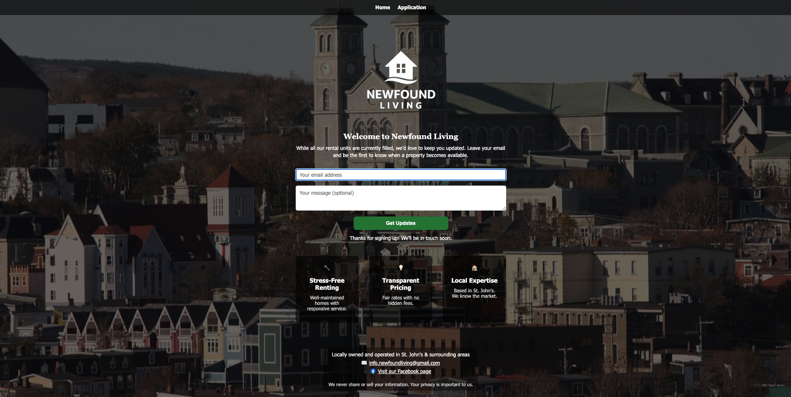
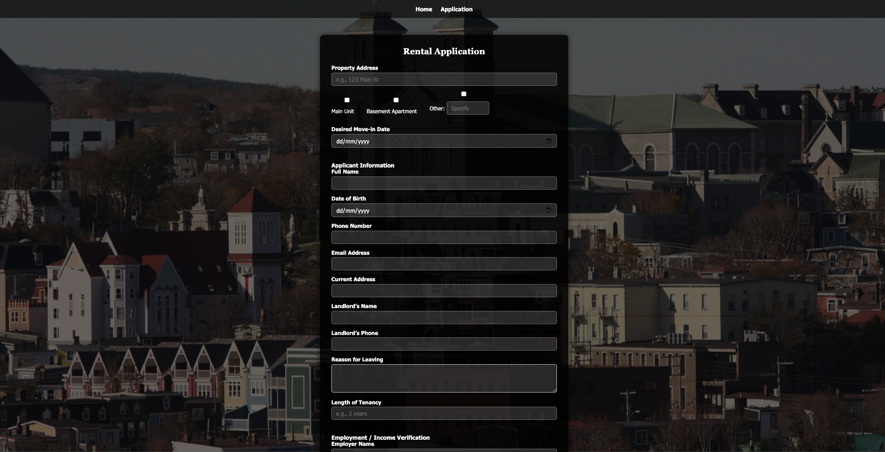

# 🏠 Newfound Living – Rental Property Management Website

This is a Flask-based web application for **Newfound Living**, a rental property management company based in St. John's, NL. The site allows users to:

- View available rental units
- Submit rental applications
- Confirm rent payments
- Join the waitlist for future properties

---

## 🌐 Live Site

Access the site at: [https://www.newfoundliving.ca](https://www.newfoundliving.ca)
---

## 🖼️ Screenshots

### Homepage

### Rental Application Page

---

## 🚀 Features

- 📄 **Rental Application Form** — Collects applicant, employment, and reference details
- 📬 **Email Notification Signup** — Users can leave their email to be notified of new availability
- ✉️ **Email Copy Button** — One-click to copy the rent payment address
